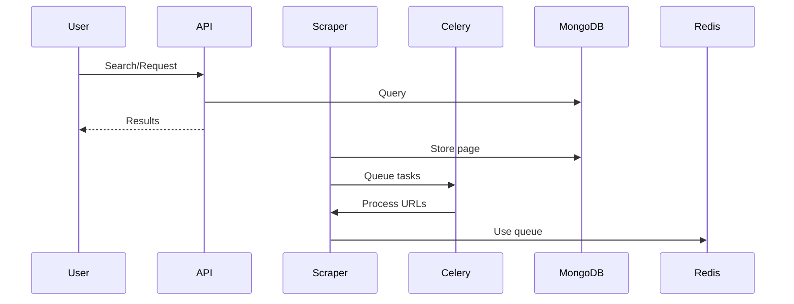
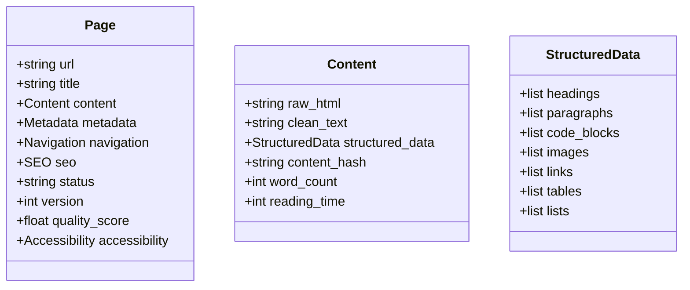

# DocuFlow: Technical Overview

This document explains, in human terms, how **DocuFlow** scrapes and organizes all content from [vijayshree.netlify.app](https://vijayshree.netlify.app/) (your portfolio website), and why it’s designed the way it is. It’s meant for engineers, product managers, and anyone curious about the architecture and design choices.

[GitHub Repo: DocuFlow](https://github.com/vijayshreepathak/DocuFlow)

---

## 1. System Goals
- **Crawl and extract** every page (especially docs) from the website
- **Store each page** as a separate, structured document in MongoDB
- **Enable fast search, retrieval, and analytics**
- **Support incremental updates and deduplication**
- **Scale out** using distributed workers (Celery + Redis)
- **Be easy to deploy and maintain** (Docker)

---

## 2. High-Level Architecture

```mermaid
flowchart TD
    subgraph User
        U1[User / API Client]
    end

    subgraph API Layer
        A1[FastAPI REST API]
    end

    subgraph Scraper Cluster
        S1[Scraper (Async, aiohttp, BeautifulSoup)]
        W1[Celery Worker(s)]
        B1[Celery Beat (Scheduler)]
    end

    subgraph Data Layer
        M1[MongoDB<br/>(pages, jobs, queue, structure)]
        R1[Redis<br/>(Celery Broker/Queue)]
    end

    subgraph Monitoring
        F1[Flower Dashboard]
        L1[Logs/Monitoring]
    end

    U1-->|HTTP Requests|A1
    A1-->|Task Submission|R1
    A1-->|Read/Write|M1
    S1-->|Scrape/Process|M1
    S1-->|Queue Tasks|R1
    W1-->|Process Tasks|S1
    W1-->|Write Results|M1
    B1-->|Schedule Tasks|R1
    F1-->|Monitor Celery|R1
    F1-->|Monitor Workers|W1
    L1-->|Logs|A1
    L1-->|Logs|S1
    L1-->|Logs|W1
    L1-->|Logs|B1

    %% Internal connections
    R1-->|Distributes Tasks|W1
    S1-->|Discovery/Queue|M1
    S1-->|Deduplication|M1
```

**Explanation:**
- **User/API Client** interacts with the FastAPI REST API.
- **API Layer** handles requests, submits tasks, and reads/writes to MongoDB.
- **Scraper Cluster** (Scraper, Celery Workers, Beat) performs distributed crawling, processing, and scheduling.
- **Data Layer** (MongoDB, Redis) stores all content and manages distributed task queues.
- **Monitoring** (Flower, Logs) provides real-time and historical system insights.
- Arrows show the flow of data and tasks between components, reflecting DocuFlow's distributed, scalable, and production-ready design.

---

## 3. Data Flow (Step by Step)

1. **Start**: The system begins with one or more start URLs (e.g., the homepage or docs root)
2. **Crawling**: The scraper discovers all internal links, queues them, and fetches each page
3. **Processing**: Each page’s HTML is parsed and structured (headings, paragraphs, images, links, etc.)
4. **Deduplication**: Pages are hashed (MD5 of clean text) to avoid storing duplicates
5. **Storage**: Each page is saved as a document in MongoDB, with all content and metadata
6. **Incremental Updates**: If a page changes, only the new version is stored (with versioning)
7. **API Access**: Users can search, filter, and retrieve pages via the REST API
8. **Distributed Processing**: Celery workers allow many pages to be processed at once, scaling horizontally

---

## 4. MongoDB Schema Design (Why Page-wise?)

- **Each page = one document** in the `pages` collection
- This makes it easy to:
  - Retrieve a whole page (all content, metadata, links, images, etc.) in one query
  - Index and search across all pages
  - Update or deduplicate pages efficiently
- **Schema Example:**

```json
{
  "url": "https://vijayshree.netlify.app/docs/page1",
  "title": "Getting Started",
  "content": {
    "raw_html": "<html>...</html>",
    "clean_text": "Welcome to the docs...",
    "structured_data": {
      "headings": [ ... ],
      "paragraphs": [ ... ],
      "images": [ ... ],
      "links": [ ... ],
      ...
    },
    "content_hash": "md5hash",
    "word_count": 350,
    "reading_time": 2
  },
  "metadata": {
    "scraped_at": "2024-07-25T12:00:00Z",
    "last_updated": "2024-07-25T12:00:00Z",
    ...
  },
  "navigation": {
    "breadcrumb": ["Docs", "Getting Started"],
    "section": "docs",
    "subsection": "getting-started",
    ...
  },
  "seo": { ... },
  "status": "processed",
  ...
}
```

- **Indexes**: Unique on `url`, text index for search, etc.
- **Other collections**: `scraping_jobs`, `url_queue`, `site_structure` for job tracking, queueing, and site map.

---

## 5. Distributed Scraping & Processing

- **Celery + Redis**: The system can run many scraper/processor workers in parallel, so it can crawl large sites quickly
- **Queueing**: URLs to be scraped are queued in MongoDB and/or Redis
- **Deduplication**: URLs and content hashes are checked before scraping/storing
- **Incremental**: If a page is already up-to-date (same hash), it’s skipped

---

## 6. API & Search

- **FastAPI**: Exposes endpoints for search, retrieval, and analytics
- **Text Search**: Uses MongoDB’s text indexes for fast, full-text search
- **Filtering**: By section, quality, tags, etc.
- **Pagination**: For large result sets
- **Job Monitoring**: See scraping job status, errors, and progress

---

## 7. Extensibility & Customization

- **Add new fields** to the schema as needed (e.g., tags, categories, custom metadata)
- **Plug in NLP** for smarter keyword extraction or summarization
- **Add authentication** to the API for private deployments
- **Integrate with other databases** or search engines if needed

---

## 8. Troubleshooting & Tips

- **Docker Issues**: Ensure all required directories (`logs`, `data`) exist before building
- **MongoDB/Redis**: Make sure ports are not blocked and you have enough disk space
- **Scaling**: Increase the number of Celery workers for faster scraping
- **Monitoring**: Use Flower dashboard (`localhost:5555`) to monitor tasks
- **Logs**: Check the `logs/` directory for detailed logs

---

## 9. Why This Design?

- **Page-wise storage**: Makes retrieval, deduplication, and search simple and efficient
- **Distributed**: Handles large sites and scales with demand
- **API-first**: Easy integration with other tools, dashboards, or analytics
- **Dockerized**: Consistent, reproducible deployments

---

## 10. Diagrams

### System Flow



### Data Model (Simplified)



---

## 11. Summary

**DocuFlow** is designed to be robust, scalable, and easy to use for scraping and managing all content from a documentation-rich website like vijayshree.netlify.app. It’s suitable for personal portfolios, knowledge bases, or any site where page-wise, structured content is valuable.

For questions or contributions, see the main README or visit the [GitHub Repo: DocuFlow](https://github.com/vijayshreepathak/DocuFlow). 